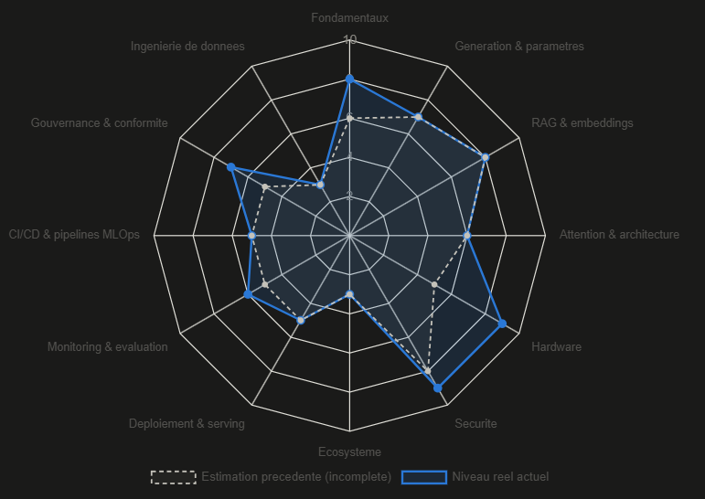

# IA — Suivi détaillé

Détail complet du module IA, extrait du README racine pour rester
lisible à mesure que le module grossit. Structure des notes organisée
en sous-dossiers thématiques (`notes/fondamentaux/`,
`notes/generation-parametres/`, `notes/rag-embeddings/`,
`notes/hardware/`, `notes/attention-architecture/`, `notes/securite/`,
`notes/ecosysteme/`) ; chaque TP a son propre dossier sous
`exercices/` (design + résultat + code).

## Radar de covering des sujets IA:

## Vague 1 (base) — terminée ✅

- [x] Terminologie : LLM, tokens, prompt/system prompt, tool use, agents, MCP, RAG, embeddings, fine-tuning
- [x] Qu'est-ce que le Machine Learning (vs programmation classique)
- [x] Réseaux de neurones — intuition (poids, activation, entraînement)
- [x] Prompting — bonnes pratiques, few-shot, limites
- [x] Usage pratique — appeler une API LLM depuis un script (Python/bash)
- [x] RAG / fine-tuning — critères de décision (fréquence, nature, volume/coût)
- [x] Limites et biais — hallucinations, sur-confiance

TP réalisé avec succès : `exercices/tp-ansible-llm/tp-ansible-llm-resultat.md`.

## Vague 2 (approfondissement) — terminée ✅

**Paramètres et fonctionnement pratique**
- [x] Fenêtre de contexte en pratique (compaction, résumé progressif, memory tool) — `notes/generation-parametres/24-fenetre-contexte-compaction.md`
- [x] Paramètres de génération (`temperature`, `top_p`/`top_k`) — `notes/generation-parametres/16-...md`, `18-top-k-top-p.md`
- [x] Multimodalité (image/PDF au-delà du texte) — `notes/generation-parametres/19-multimodalite-patches-positional-embedding.md`
- [x] Guardrails et garde-fous en production (prompt injection, moindre privilège, filtrage de sortie, défense en profondeur) — `notes/securite/25-guardrails-prompt-injection-moindre-privilege.md`
- [x] Coûts et facturation (tokens → €, input vs output) — `notes/generation-parametres/26-couts-facturation-input-output.md`

**Hardware — pourquoi l'IA est si gourmande**
- [x] Pourquoi l'entraînement/inférence dévore de la RAM/VRAM (taille des poids, précision numérique FP16/INT8, quantization)
- [x] Rôle du GPU vs CPU (parallélisme massif, multiplication de matrices)
- [x] CUDA vs Tensor Cores (logiciel vs matériel spécialisé)
- [x] Entraînement vs inférence (facteur ×4-6 : gradients, états d'optimiseur, activations)
- [x] Fine-tuning partiel — LoRA / QLoRA (rang intrinsèque faible, combinaison avec la quantization)
- [x] Panorama des LLM actuels (propriétaires vs open-weight, critères de choix, routing multi-modèles)

Notes : `notes/hardware/12-...md`, `13-...md`, `14-panorama-llm-qlora.md`.

**Outils de l'écosystème**
- [x] Frameworks d'orchestration (LangChain/LangGraph, LlamaIndex, CrewAI) — `notes/ecosysteme/27-panorama-outils-ecosysteme-hermes-mcp.md`
- [x] Bases de données vectorielles (Pinecone, Chroma, Weaviate, Qdrant, pgvector)
- [x] Outils no-code/low-code avec IA (n8n, Zapier)
- [x] Assistants de code (Claude Code, Copilot)
- [x] Serveurs MCP existants (panorama) + aparté Hermes (modèle open-weight vs Hermes Agent, framework agentique)

**TP**
- [x] Agent Ansible avec boucle autonome (`include_tasks`/`loop`) — **réalisé avec succès** ✅ — `exercices/tp-ansible-agent/`
- [x] Visualiser des embeddings de mots (gensim/GloVe, PCA, matplotlib) — **réalisé avec succès** ✅ — `exercices/tp-visualisation-embeddings/`
- [x] RAG sur son propre repo + serveur MCP maison — **réalisé avec succès** ✅ — `exercices/tp-rag-mcp/`
- [x] LLM local de bout en bout — Ollama (inférence) puis Unsloth/QLoRA (fine-tuning) sur RTX 3070 8 Go, WSL2 — **réalisé avec succès** ✅ — `exercies/tp-llm-local/`
- [x] Sécuriser le serveur RAG/MCP (guardrail pattern + guardrail sémantique) — **réalisé avec succès** ✅ — `exercices/tp-securite/`

## Vague 3 (MLOps/Ops) — en préparation 🚧

Identifiée via un radar de comparaison avec un référentiel junior
MLOps (~2 ans d'XP) — ces catégories étaient jusqu'ici des angles
morts complets du module.

### 1. Déploiement & serving
- [ ] Conteneuriser un modèle (Docker) — packager un serving simple
- [~] Frameworks de serving dédiés (vLLM, TGI, Triton) vs un serveur classique — pourquoi ils existent vu, jamais testés concrètement
- [x] Scaling horizontal et load balancing pour une API de modèle
- [ ] Autoscaling selon la charge (Kubernetes HPA ou équivalent cloud)
- [x] Batching de requêtes (dynamic batching, timeout)
- [ ] Streaming de réponses

TP prévu : conteneuriser le serveur MCP + scaling horizontal léger — idée notée dans `exercices/idees-tp-vague3.md`, design détaillé à venir.

### 2. Monitoring & évaluation
- [ ] Logging structuré des requêtes/réponses d'un LLM en prod
- [x] Recall@k et golden dataset (métrique RAG de base)
- [x] Faithfulness/groundedness (fidélité de la réponse générée aux documents)
- [x] Détection de drift (data drift, concept drift, causes identifiées : doc obsolète, vocabulaire, modèle managé, chunking incohérent)
- [ ] Traçabilité/observabilité (LangSmith ou équivalent)
- [ ] Alerting sur dégradation de qualité ou de performance

TP prévu : golden dataset automatisé (recall@k + LLM-as-judge sur la faithfulness) — idée notée dans `exercices/idees-tp-vague3.md`, design détaillé à venir.

### 3. CI/CD & pipelines MLOps

- [x] Registre de modèles (model registry) — versionner un modèle comme un artefact
- [x] Tracking d'expériences (MLflow, W&B) — comparer plusieurs runs/fine-tunings
- [x] Pipeline de réentraînement automatisé (déclenché par drift ou planning)
- [x] Tests automatisés spécifiques au ML (régression sur les sorties, pas juste tests de code classique)
- [x] Déploiement progressif (canary, blue-green) appliqué à un modèle

TP prévu : pipeline CI/CD sur le repo (GitHub Actions relançant indexation + golden dataset, échec du build si recall@k sous seuil) — idée notée dans `exercices/idees-tp-vague3.md`, design détaillé à venir.

### 4. Gouvernance & conformité

- [x] RGPD appliqué à l'IA (données personnelles dans les prompts/logs)
- [x] AI Act européen — grandes lignes, catégories de risque
- [ ] Documentation type "model card" / "system card"
- [ ] Audit trail — tracer qui a demandé quoi, quelle version de modèle a répondu
- [ ] Biais et équité (fairness) — angle gouvernance, pas ML pur

TP prévu : rédiger une vraie "system card" pour le serveur `notes-formation` — idée notée dans `exercices/idees-tp-vague3.md`, design détaillé à venir.

### 5. Ingénierie de données pour le ML

- [~] Pipelines d'ingestion et de nettoyage de données (entraînement ou RAG) — introduction posée (ETL déjà pratiqué via `index_notes.py`, pas encore de nettoyage/validation formalisés)
- [ ] Versioning de données (DVC ou équivalent) — pourquoi une donnée doit être versionnée comme du code
- [ ] Feature stores — concept, à quoi ça sert
- [~] Qualité et validation de données (détection d'anomalies, schémas) — principe "fail loud vs silencieux" vu sur un vrai bug (fichier vide non détecté)
- [ ] Cycle de vie de la donnée (rétention, suppression, lien avec RGPD)

Notes : `notes/ingenierie-donnees/41-introduction-etl-validation-fail-loud.md`.

TP prévu : versionner la base Chroma avec DVC — idée notée dans `exercices/idees-tp-vague3.md`, design détaillé à venir.

## Hors programme (approfondissements ponctuels)

- [x] Deep learning vs Machine Learning (arbres de décision, forêts aléatoires) — `notes/fondamentaux/15-deep-learning-vs-ml-arbres-forets.md`
- [x] Pré-entraînement vs fine-tuning d'instruction (+ RLHF, biais structurel) — `notes/fondamentaux/17-pretraining-vs-instruction-tuning.md`
- [x] Mécanisme d'attention (Query/Key/Value, multi-head) — `notes/attention-architecture/20-mecanisme-attention-qkv-multihead.md`
- [x] Carte de consolidation du pipeline complet — `notes/attention-architecture/21-carte-consolidation-pipeline-llm.md`
- [x] Série de questions de consolidation — `notes/attention-architecture/22-serie-consolidation-couches-attention-rag.md`
- [x] Visualisation des embeddings dans l'espace, arithmétique vectorielle, hypothèse distributionnelle — `notes/rag-embeddings/23-visualisation-embeddings-hypothese-distributionnelle.md`
- [x] Bases de données vectorielles en profondeur (ANN/HNSW, angle sysadmin) — `notes/rag-embeddings/30-bases-vectorielles-ann-hnsw-sysadmin.md`
- [x] Chunking en profondeur (chevauchement, taille adaptative, chunking sémantique) — `notes/rag-embeddings/31-chunking-chevauchement-taille-adaptative.md`

## Ressources externes

Voir `ressources-externes.md` — vidéos (3Blue1Brown, Karpathy) et livre
(Géron) recommandés pour consolider les sujets les plus visuels
(couches, activation, attention).
