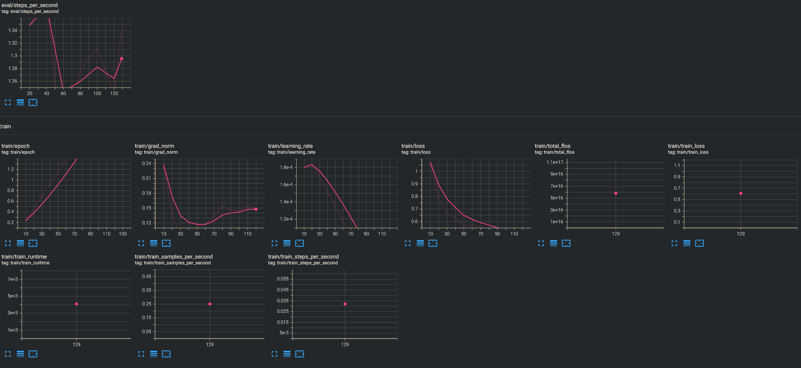
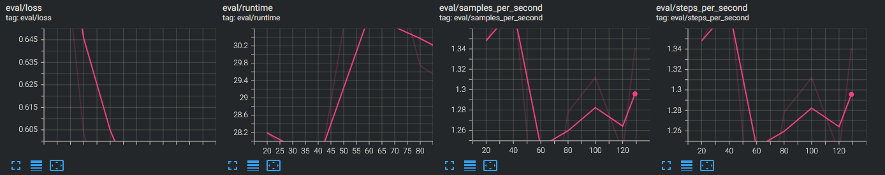

# TP — LLM local, Phase 3 (lancement effectif de l'entraînement QLoRA) : réalisée ✅

Complète `tp-llm-local-phase2-resultat.md` (préparation dataset,
terminée). Cette phase couvre la configuration réelle d'Unsloth, le
diagnostic VRAM approfondi, l'entraînement effectif, et l'évaluation
post-fine-tuning — avec deux tests de contrôle méthodologiques ayant
mené à réviser une conclusion initialement trop optimiste.

## Script d'entraînement — première version

Basé sur la syntaxe Unsloth à jour pour Qwen3 (`FastLanguageModel`,
`get_chat_template`, `get_peft_model`, `SFTTrainer`/`SFTConfig`).
LoRA : `r=16`, `lora_alpha=16`, cible les 7 couches linéaires standard
(q/k/v/o_proj, gate/up/down_proj). Pas de mix 75/25
raisonnement/non-raisonnement (décision prise en Phase 2, capacité de
raisonnement de Qwen3 jugée non prioritaire pour cette tâche).

## Bugs système, dans l'ordre de découverte

### 1. `AttributeError: ThinkingBlock` puis erreurs d'installation en cascade
Résolus en Phase 2 (thinking désactivé, extraction par type de bloc).

### 2. `ValueError: Some modules are dispatched on the CPU`
`device_map="auto"` de `transformers` a mal évalué la VRAM disponible
malgré de la VRAM libre confirmée via `nvidia-smi`. Corrigé en forçant
`device_map={"": 0}` explicitement.

### 3. `RuntimeError: Failed to find C compiler`
Triton (utilisé par Unsloth pour compiler ses kernels GPU à la volée)
nécessite un compilateur C. Corrigé via `sudo apt install
build-essential`.

### 4. `fatal error: Python.h: No such file or directory`
Même mécanisme Triton, nécessite aussi les en-têtes de développement
Python. Corrigé via `sudo apt install python3-dev` (ou la version
exacte, `python3.12-dev`).

### 5. `CUDA out of memory` au tout premier pas d'entraînement (modèle 8B)
Diagnostic en plusieurs temps :
- Empreinte mémoire du modèle seul : **7.38 Go** sur 8 Go de carte —
  bien au-delà des ~4.5-5 Go attendus pour un 8B en 4-bit pur
- Cause identifiée : la table d'embeddings et `lm_head` ne sont
  généralement **pas quantifiées** par bitsandbytes (question de
  précision), et Qwen3 a un vocabulaire de ~150k tokens — ces couches
  seules représentent probablement 1-2 Go supplémentaires en
  bfloat16
- **Point méthodologique important** : la quantification GGUF
  utilisée par Ollama (Phase 1, ~6.2 Go pour le 8B en inférence) et la
  quantification bitsandbytes NF4 utilisée par Unsloth pour
  l'entraînement ne sont **pas équivalentes** en efficacité mémoire

### 6. Décision : pivot du modèle de base, 8B → 4B
Bascule vers `unsloth/Qwen3-4B-Instruct-2507-unsloth-bnb-4bit`
(version pré-quantifiée "Dynamic 2.0" d'Unsloth, variante non-thinking).
Empreinte mémoire du 4B : **3.50 Go** — marge confortable retrouvée.
Conséquence méthodologique assumée : une nouvelle baseline a été
générée spécifiquement sur `qwen3:4b` plutôt que de comparer au 8B.

### 7. `Triton is not supported on current platform, roll back to CPU`
Warning initialement jugé possiblement inoffensif. Réévalué après
coup : le vrai signal pertinent était ailleurs dans le banner
(`FA [Xformers = None. FA2 = False]`) — Flash Attention 2 n'était pas
actif, ce qui a une vraie conséquence mémoire (coût quadratique de
l'attention standard sur les longues séquences).

### 8. `CUDA out of memory` toujours présent sur le 4B malgré la marge
Diagnostiqué comme lié à l'absence de Flash Attention 2. Installation
de `flash-attn` via wheels précompilés
(github.com/mjun0812/flash-attention-prebuild-wheels) plutôt que
compilation locale — vérification préalable de la correspondance
exacte Python 3.12 / PyTorch 2.11 / CUDA 13.0 (version tirée du
banner Unsloth : `Torch: 2.11.0+cu130`, pas de `nvidia-smi` ni
`nvcc`, qui indiquent des versions différentes et moins pertinentes
ici). `FA2 = True` confirmé après installation.

### 9. `CUDA out of memory` une troisième fois malgré Flash Attention 2
Nouveau message : `Unsloth: Double buffering enabled (parallel H2D +
compute) for backward pass` — mécanisme échangeant de la mémoire
contre de la vitesse (~8% de gain). Pas de toggle simple trouvé pour
le désactiver. Décision pragmatique : réduire `max_seq_length` de
4096 à **3072**, acceptant l'exclusion de 124/504 exemples (24.6%) du
dataset d'entraînement en échange d'une marge de sécurité réelle.

### 10. `CUDA out of memory` au step 20, spécifiquement pendant l'évaluation
L'entraînement tournait correctement (20 premiers pas passés, loss en
baisse). Le plantage survient dans `evaluation_loop` →
`prediction_step` → conversion des logits en **float32** — opération
de précision pleine, combinée au grand vocabulaire de Qwen3, demandant
significativement plus de mémoire qu'un pas d'entraînement classique.
Corrections combinées :
- `per_device_eval_batch_size=1` explicite (jamais fixé jusque-là)
- `PYTORCH_CUDA_ALLOC_CONF=expandable_segments:True` (variable
  d'environnement, à définir avant tout import) pour réduire la
  fragmentation mémoire signalée dans le message d'erreur

## Entraînement final — déroulement

Une fois les 10 bugs corrigés, l'entraînement a tourné jusqu'au bout :
**129 steps, 3 epochs, ~1h08 (4082s)**, sur 447 exemples d'entraînement
/ 50 de validation (après filtrage à `max_seq_length=3072`).

**Progression de la loss** (points clés) :

| Step | epoch | train_loss | eval_loss |
|---|---|---|---|
| 10 | 0.23 | 1.072 | — |
| 20 | 0.47 | 0.787 | 0.716 |
| 40 | 0.94 | 0.631 | 0.603 |
| 59 | 1.16 | 0.569 | — |
| 70 | 1.63 | 0.554 | 0.566 |
| 129 (fin) | 3.0 | 0.611 (moyenne) | — |

`train_loss` et `eval_loss` restent constamment proches à chaque
point mesuré — aucun signe de surapprentissage observé sur ce volume
de données. `grad_norm` décroît de façon stable (0.24 → ~0.10-0.15),
pas d'instabilité.

**Variance de vitesse observée** (17s/it à ponctuellement 123s/it) :
diagnostiquée comme un effet du "padding-free" (regroupement dynamique
de séquences de longueurs variables par lot), pas un problème matériel
— confirmé par `nvidia-smi` stable (pas de throttling thermique, 51-57°C,
231W/240W). Piste identifiée mais non appliquée : `group_by_length=True`
rendrait chaque lot plus homogène en temps de calcul, au prix d'une
corrélation longueur/type de contenu par step (les logs les plus longs
étant probablement associés à certains types d'incidents) — à
considérer pour un futur entraînement plus long où la prévisibilité du
temps total compterait davantage.

## Évaluation post-fine-tuning — diagnostic des bugs de génération

### Bug 11 : dégénérescence en boucle sur `<tool_call>`

Premier essai d'évaluation (`do_sample=False`, décodage glouton pur,
sans garde-fou anti-répétition) : le modèle boucle indéfiniment sur le
token spécial `<tool_call>` au lieu de répondre. Diagnostic par
élimination :
- Prompt vérifié explicitement (print du texte complet envoyé) : pas
  de section outils résiduelle, template conforme à celui de
  l'entraînement
- `eos_token_id` vérifié cohérent (151645, `<|im_end|>`) — pas de
  désalignement
- Cause retenue : décodage glouton pur, sans garde-fou, combiné à un
  fine-tuning étroit sur un modèle nativement conçu pour l'agentic
  (d'où `<tool_call>` comme token "sûr" auquel se raccrocher)

### Correction 1 : `repetition_penalty=1.3` + `no_repeat_ngram_size=3` — effet de bord découvert

Casse la boucle, mais corrompt finement les noms de champs JSON
(`cause_racune`, `symptome_oberve`, `service_affect`,
`action_recounmendee`). Mécanisme compris : la pénalité de répétition
s'applique à chaque token déjà généré, sans distinguer une boucle
absurde d'un sous-mot légitime qui revient normalement — ici, les
noms de champs eux-mêmes (répétés mot pour mot depuis la consigne
présente dans le prompt) se retrouvent pénalisés par
`no_repeat_ngram_size`, qui s'applique sur toute la séquence, prompt
inclus, forçant des variantes fautives pour les contourner. Effet
surnommé "dyslexie" en session — image juste du phénomène.

### Correction 2 (retenue) : prefill plutôt que paramètres de décodage

Solution la plus propre : forcer le début de la réponse assistant à
`{` avant la génération, rendant `<tool_call>` structurellement
impossible comme premier token :

```python
texte = tokenizer.apply_chat_template(messages, tokenize=False, add_generation_prompt=True)
texte += "{"
inputs = tokenizer(texte, return_tensors="pt").to("cuda")
sortie = model.generate(**inputs, max_new_tokens=500, do_sample=False)
reponse = "{" + tokenizer.decode(sortie[0][inputs.input_ids.shape[1]:], skip_special_tokens=True)
```

Confirmé en retirant `no_repeat_ngram_size` : les noms de champs
redeviennent parfaitement exacts sans lui, une fois le prefill en
place. Configuration finale : **aucun** paramètre anti-répétition
nécessaire.

### Bug 12 : écart massif de comptage de tokens entre Ollama (GGUF) et transformers (HF)

Le cas 3 (log 520 lignes) mesurait 4098 tokens via Ollama, mais 20543
tokens via le tokenizer HF — facteur ~5x. Diagnostic par étapes :
1. Contenu du log vérifié intact (520 lignes, début/fin cohérents)
2. Tokenizer sauvegardé après fine-tuning comparé à l'original sur une
   phrase courte : identique (29 tokens) — pas de corruption
3. Découpage en tranches de 50 lignes : coût réparti uniformément
   (~1900-2300 tokens/tranche) — pas de ligne isolée anormale
4. Tokenizer original (non fine-tuné) sur la même tranche : chiffre
   identique (1712 tokens) — élimine toute responsabilité du
   fine-tuning ou de la sauvegarde

**Conclusion retenue** : différence d'implémentation entre le
tokenizer GGUF (`llama.cpp`) et HF (`transformers`) sur du contenu
très dense en chiffres — hypothèse plausible : découpage des nombres
chiffre par chiffre par le tokenizer HF. Conséquence concrète : le
cas 3 dépassait `max_seq_length=8192` (pensé "large" sur la base du
mauvais référentiel) et se retrouvait réellement tronqué. Corrigé en
remontant `max_seq_length` à 24576 pour l'évaluation.

## Résultats par cas (évaluation post-fine-tuning finale)

Paramètres de génération retenus : `do_sample=False`, prefill `{`,
aucun paramètre anti-répétition, `max_seq_length=24576`.

### Cas 0 (OOM) — bon résultat

PID exacts corrects (15234, 15301, 15412, 15489), progression du heap
correctement extraite (91→95%), nombre de tentatives de redémarrage
exact (4). Qualité comparable à la référence Claude.

### Cas 1 (DNS/iptables) — bon résultat

Structure exacte, cause racine correctement identifiée (règles
iptables OUTPUT), recommandations détaillées et ordonnées.

### Cas 2 (LDAP/SSSD) — erreur persistante, non corrigée par le fine-tuning

Même confusion que la baseline et que le 8B : invente un problème de
certificat TLS au lieu du vrai problème de connectivité réseau/timeout.
Les 18 types d'incidents du dataset ne couvraient pas explicitement
cette distinction — le fine-tuning ne corrige que ce qu'il a vu.

### Cas 3 (disque plein, 520 lignes) — amélioration observée, puis conclusion révisée après test de contrôle

**Résultat brut observé** : la baseline 4B (via Ollama) hallucinait
une "attaque par force brute SSH" ; le modèle fine-tuné (via
transformers, prefill, `max_seq_length=24576`) identifie correctement
la saturation disque, le bon service coupable (backup-job), les bons
services impactés.

**Remise en question méthodologique (voir section suivante)** : cette
comparaison changeait **deux variables en même temps** (fine-tuné ou
non, ET pipeline de tokenisation/contexte). Un test de contrôle dédié
a été nécessaire pour trancher si l'amélioration venait réellement du
fine-tuning.

## Test de contrôle n°1 — la boucle `<tool_call>` vient-elle du fine-tuning ou du mode de génération ?

**Problème identifié** : entre la baseline (Ollama, échantillonnage
par défaut) et l'évaluation post-fine-tuning (transformers,
`do_sample=False`), deux variables changeaient simultanément (modèle
fine-tuné ou non, ET mode de génération). Le vanilla n'avait jamais
été testé en décodage glouton pur.

**Test conçu** : faire tourner le modèle **vanilla** via la **même
chaîne d'outils** que l'évaluation post-fine-tuning (transformers,
`do_sample=False`, sans prefill), pour isoler la seule variable
"fine-tuné ou non".

**Résultat** : le vanilla produit une réponse JSON propre, sans aucune
boucle ni `<tool_call>`, en mode glouton pur.

**Conclusion tranchée** : le mode de génération seul n'explique pas la
boucle — c'est bien le **fine-tuning** qui l'a introduite.
Hypothèse retenue : l'entraînement sur un dataset étroit (342 exemples,
3 epochs, une seule tâche) a sur-spécialisé le modèle au point de
**dégrader sa robustesse** face au décodage glouton — un mode de
génération sur lequel l'entraînement supervisé (qui optimise la
vraisemblance des tokens de référence, pas le comportement en
génération autonome) n'agit pas directement.

**Portée générale** : compromis classique du fine-tuning sur petit
volume — améliorer la performance sur la tâche cible peut dégrader des
capacités annexes non couvertes explicitement par le dataset. Le
prefill reste la solution retenue pour contourner ce problème en
production.

## Test de contrôle n°2 — l'amélioration sur le cas 3 vient-elle vraiment du fine-tuning ?

**Problème identifié** (soulevé a posteriori) : la comparaison
"baseline 4B via Ollama" vs "fine-tuné via transformers,
`max_seq_length=24576`" changeait, ici aussi, **deux variables** —
fine-tuné ou non, ET le pipeline de tokenisation (GGUF ~4098 tokens
vs HF ~20543 tokens pour le même log). Or le "lost in the middle" est
sensible à la **distance en tokens**, pas à la position sémantique
dans le texte brut — le signal clé (lignes 21-30) se trouve donc
"plus loin" de la question en comptage HF qu'en comptage GGUF, à
contenu identique.

**Test conçu** : faire tourner le modèle **vanilla** sur le cas 3,
avec exactement le **même pipeline** que l'évaluation post-fine-tuning
(transformers, `max_seq_length=24576`, prefill `{`, `do_sample=False`)
— isoler la seule variable "fine-tuné ou non".

**Résultat** : le vanilla, dans ces conditions précises, identifie
**correctement** la saturation disque comme cause — aucune trace de
l'hallucination "attaque SSH" observée via Ollama.

**Conclusion révisée** : l'amélioration observée sur le cas 3 ne vient
**pas** du fine-tuning — elle vient du changement de pipeline
(tokenisation différente + prefill), qui modifiait déjà la difficulté
du problème pour le vanilla lui-même, indépendamment de tout
entraînement. Le biais de prior documenté en note 42 (5e mode
d'échec) semble donc **spécifique aux conditions de test d'origine**
(pipeline Ollama/GGUF, signal très dilué en tokens) plutôt qu'une
propriété stable et générale du modèle que le fine-tuning aurait
réparée.

**Leçon méthodologique retenue, la plus importante de cette Phase 3** :
un protocole de test avant/après doit isoler **une seule variable** du
début à la fin — model fine-tuné ou non — et geler strictement tout le
reste (pipeline, tokenizer, paramètres de génération, fenêtre de
contexte). Comparer une baseline et un résultat post-entraînement
mesurés avec des outils différents peut faire passer un artefact de
mesure pour un progrès réel. Ce trou méthodologique aurait dû être
anticipé dès la conception du protocole de test, pas corrigé après
coup par deux tests de contrôle réalisés dans l'urgence en fin de
session.

## Bilan global de la Phase 3 (révisé)

- Entraînement complet mené à bien (3 epochs, 129 steps, ~1h08),
  malgré une dizaine de bugs système distincts avant d'y arriver
- Loss stable et cohérente tout du long, `eval_loss` toujours proche
  de `train_loss` — pas de signe de surapprentissage sur ce volume de
  données
- **Résultat net sur la qualité des réponses** : stable à légèrement
  positif sur les cas courts (0, 1), inchangé sur l'erreur du cas 2
  (LDAP), et **non démontré** sur le cas 3 (l'amélioration apparente
  était un artefact de pipeline de test, pas un effet du fine-tuning)
- **Régression identifiée et confirmée** : le fine-tuning a dégradé la
  robustesse du modèle en décodage glouton pur (boucle sur
  `<tool_call>`), un effet de bord qui n'aurait pas pu être découvert
  sans un test de contrôle dédié
- Coût réel du fine-tuning très largement supérieur au temps de calcul
  pur : diagnostic système (compilateur, headers, Flash Attention,
  VRAM), pivot de modèle en cours de route, itérations sur les
  paramètres de génération, et deux erreurs méthodologiques de
  comparaison corrigées a posteriori
- **Conclusion honnête du TP** : sur ce volume de données (342
  exemples après filtrage) et cette tâche (extraction structurée déjà
  bien gérée par le modèle de base), le fine-tuning n'apporte pas de
  gain net démontré, et introduit au moins une régression de
  robustesse. Confirme empiriquement, de façon plus nuancée que prévu,
  le principe déjà énoncé en session : le fine-tuning est un outil à
  réserver en dernier recours, une fois les alternatives plus simples
  (prompt, RAG) réellement épuisées — et son évaluation exige une
  rigueur méthodologique (isolation stricte des variables) qui n'a été
  atteinte ici qu'après coup, pas dès la conception du protocole

## Captures TensorBoard de l'entraînement final

Run isolée (`Jul27_19-05-58`, filtrée sur les autres essais avortés).
Le trait fin/transparent correspond aux valeurs brutes, le trait
épais/coloré à la version lissée (smoothing 0,6) — comportement
standard de TensorBoard, pas plusieurs runs superposées.





## Debrief — lecture des métriques d'entraînement

- **`loss`** : cross-entropy entre prédiction et réponse de
  référence, token par token — la métrique centrale, doit baisser
  globalement
- **`grad_norm`** : ampleur du gradient à chaque étape — jauge de
  stabilité (explosion = divergence, quasi-zéro trop tôt =
  apprentissage qui s'arrête)
- **`learning_rate`** : suit la montée du warmup (`warmup_steps=10`)
  jusqu'au taux cible (`2e-4`)
- **`epoch`** : simple indicateur de progression dans le dataset

## Compétences pratiquées

- Diagnostic mémoire multi-couches : quantification (bnb vs GGUF),
  vocabulaire du modèle, Flash Attention, double buffering
- Lecture de traceback pour localiser précisément la phase concernée
  (entraînement vs évaluation) avant de choisir un correctif
- Vérification de compatibilité de version tirée de la bonne source
  (banner du framework, pas `nvidia-smi`/`nvcc`) avant d'installer un
  binaire précompilé
- Arbitrage pragmatique entre poursuite d'optimisation et obtention
  d'un résultat qui fonctionne
- Lecture et interprétation de métriques d'entraînement en conditions
  réelles
- Diagnostic d'un problème de génération par élimination méthodique
  (prompt, config de tokens, paramètres de décodage)
- Compréhension du compromis entre garde-fous anti-répétition — un
  outil plus brutal peut introduire un effet de bord pire que le
  problème corrigé
- Localisation d'une anomalie par dichotomie avant de conclure
- **Conception de tests de contrôle isolant une seule variable**,
  après avoir repéré à deux reprises qu'une conclusion reposait en
  fait sur plusieurs changements simultanés — et acceptation de
  résultats inconfortables (le fine-tuning a dégradé quelque chose,
  l'amélioration observée n'était pas réelle) plutôt que la recherche
  d'une explication de confort

## Prochaine étape possible

Si l'objectif est de démontrer un vrai gain du fine-tuning : refaire
un test avant/après avec un protocole rigoureux dès le départ (même
pipeline, même tokenizer, même fenêtre de contexte, même mode de
génération pour vanilla ET fine-tuné), et sur un jeu de test plus
large que 4 cas pour une conclusion statistiquement plus robuste.

## Note de clôture — limites de l'échantillon unique

Deux nuances supplémentaires, à la relecture :

1. La correction méthodologique ne remet pas en cause l'entraînement
   lui-même (dataset, LoRA, hyperparamètres) — seul le protocole de
   comparaison avant/après était en cause. Refaire tourner le même
   entraînement produirait vraisemblablement le même résultat.

2. Un vrai gain démontrable nécessiterait probablement un dataset
   plus large et plus de ressources de calcul — hypothèse plausible
   au vu du volume d'entraînement (342 exemples), mais non testée.

3. Certaines précisions dans la réponse fine-tunée sur le cas 3
   (horaires 08:15-08:30, absents de la réponse vanilla du test de
   contrôle) pourraient être un vrai effet de l'entraînement, ou
   simplement une variance de génération sur un unique essai. Un seul
   cas de test, sans répétition ni variation de seed, ne permet pas de
   trancher entre les deux — à garder comme question ouverte plutôt
   que comme conclusion.
