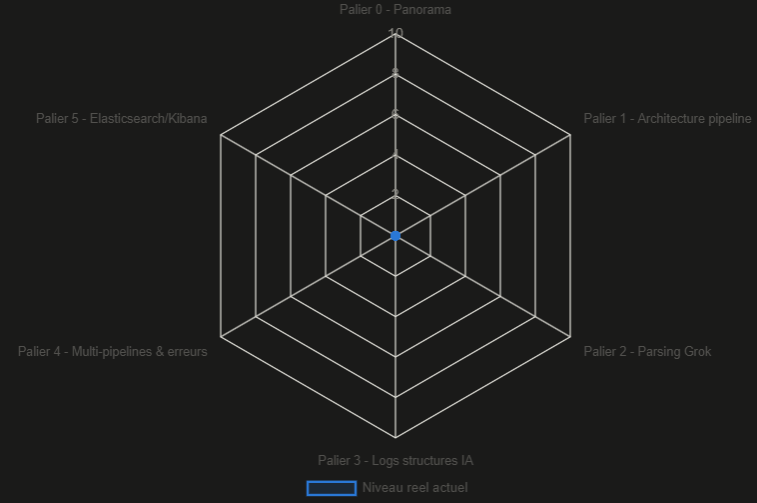

# Logstash — Suivi détaillé

Détail complet du module Logstash, extrait du README racine pour
rester lisible si le module grossit au-delà du prévu initial (comme
pour le module IA). Structure : `notes/` (numérotation indépendante,
repart à 1), `pipelines/` (fichiers `.conf` par palier/TP),
`ressources-externes.md`.

## Radar de couverture des paliers

Ce radar est indicatif : il estime la couverture du repo (notes,
scripts, résultats testés) face au plafond de quelqu'un pratiquant
Logstash au quotidien depuis 2-3 ans — le 10 représente ce plafond
estimé, pas la perfection absolue. La partie Elasticsearch/Kibana
n'étant que du bonus pour ce module (pas l'objectif central), un
score bas à cet endroit ne reflète pas un retard préoccupant à
combler en priorité.

## Environnement

- Version ciblée : **Logstash 8.19.x** (LTS, support jusqu'au 15 juillet
  2027) — choisie plutôt que la 9.x pour rester sur la ligne la plus
  stable/documentée sans contrainte JDK 21
- Deux VM disponibles : RHEL8 existante (déjà utilisée pour
  Ansible/RHCSA), et Rocky/Alma 9 fraîche (équivalent binaire RHEL9)
- Dimensionnement lab : 2 vCPU / 4 Go RAM / 20 Go disque pour Logstash
  seul ; prévoir 16 Go RAM si Elasticsearch/Kibana s'ajoutent plus tard
  (Palier 5)

## Palier 0 — Panorama 

- [x] Comparatif Logstash vs rsyslog/syslog-ng, Fluentd/Fluent Bit,
      Vector — où Logstash se situe (JVM plus lourd, mais parsing Grok
      riche + intégration Elastic native)
- [x] Interfaçage au-delà d'Elasticsearch/Kibana — Kafka, JDBC, S3,
      SIEM tiers (Sentinel, Splunk), Grafana/Loki
- [x] Sécurité du produit — filtre `ruby` (exécution de code), CVE
      ESA-2026-29 (traversée de chemin), chaîne d'approvisionnement des
      plugins, port API 9600 non authentifié
- [x] Logstash au service de la sécurité — enrichissement threat intel
      (`translate`), plugin `threats_classifier` (MITRE ATT&CK),
      intégration SOAR
- [x] Options CLI de confort `notes/06-options-cli-confort.md`
- [x] Panorama ECS (Elastic Common Schema) — principes, field sets courants
- [x] Panorama des outils Beats (Filebeat, Metricbeat, etc.)
- [x] Panorama Elastic Agent/Fleet — où Logstash reste pertinent vs Agent (managed pipelines) suffit
- [x] TLS entre composants (Beats→Logstash, Logstash→Elasticsearch) → pratiqué au TP Beats du Palier 3

## Palier 1 — Architecture (input/filter/output), premier pipeline, présentation configuration générale

- [x] Structure d'un fichier `.conf` de pipeline, notion d'event Logstash
- [x] Premier pipeline trivial (`stdin`/`stdout`), filtre `mutate`
- [x] Démarrage en ligne de commande
- [x] `logstash.yml` - config globale de l'instance (nom du nœud, taille des batchs, nombre de workers, type de queue)
- [x] Type de queue interne (mémoire vs persistante sur disque)
- [x] `pipelines.yml` - définition de plusieurs pipelines
- [x] `jvm.options` - Paramètres JVM pour logstash
- [x] Codecs — brique distincte des filtres (recroisée au Palier 3, `codec json`)
- [x] Patterns Grok personnalisés (`patterns_dir`) — notion théorique
- [x] Panorama des endpoints de l'API (port 9600)
- [x] Keystore (`logstash-keystore`) — secrets hors `.conf` en clair
- [ ] Communication pipeline-to-pipeline (`input`/`output pipeline`), à distinguer des pipelines isolés de `pipelines.yml`

- [x] TP: Ecrire un rôle Ansible pour déployer Logstash

## Palier 2 — Filtres et Parsing Grok

- [x] Filtre `grok` (patterns prédéfinis), `mutate`
- [x] Filtres conditionnels basiques (`if [champ] == "valeur"`)
- [x] Filtre `dissect` en pratique
- [x] Filtre `date` (remplacer `@timestamp` par le vrai timestamp du log)
- [ ] Filtre `mutate`, `convert` (conversion 'unité/type), `gsub`, `split`, `merge`

- [ ] TP: reparser le log d'incident `tp-ansible-agent` — remplacer la lecture manuelle faite à l'œil ce soir-là par un vrai pipeline. 
- [ ] TP: parser la sortie verbeuse d'un `ansible-playbook -v` avec un pattern grok sur mesure.

## Palier 3 — Logs applicatifs/IA structurés (renforcement du Palier 2)

- [ ] Codec `json` en profondeur (amorcé en Palier 1, note 10)
- [ ] Filtres conditionnels avancés (`and`/`or`, `=~`, `in`, `!`)
- [ ] Liste de patterns dans un `match` + `break_on_match`, vs blocs `if`
- [ ] Patterns Grok personnalisés en pratique (`patterns_dir`)
- [ ] Filtre/codec `multiline` — recoller les stack traces (Java) éclatées 

- [ ] TP: ingérer le schéma de logging LLM (note 46) et Observation `/_node/stats/pipelines` sur le pipeline JSON/IA
- [ ] TP: Connecter RH8103 comme client Filebeat vers Logstash (Rocky9)
- [ ] TP: callback plugin `community.general.logstash` — playbook en direct vers Logstash.

## Palier 4 — Sorties multiples, gestion d'erreurs, supervision

- [ ] Sorties multiples
- [ ] Dead letter queue native (DLQ)
- [ ] `/_node/logging` — monter le niveau de log à chaud (PUT) pour diagnostic hausse d'échecs (DLQ qui grossit) sans redémarrer le pipeline

- [ ] TP: router les échecs de tâches Ansible (via le callback plugin logstash) vers une sortie séparée.
- [ ] TP: Persistent queue — simuler un crash en cours de traitement, vérifier la reprise

## Palier 5 — Sortie Elasticsearch/Kibana

- [ ] Sortie vers Elasticsearch, visualisation Kibana
- [ ] API → Elasticsearch : `http_poller` interrogeant - visualisation santé logstash dans Kibana

**Pont prévu** : débloquerait potentiellement le TP Monitoring IA
(golden dataset/recall@k, resté en draft) — visualiser les résultats
d'évaluation dans un vrai dashboard plutôt qu'en `print()` console,
ce qui à son tour débloquerait le TP CI/CD qui en dépend.

## Niveau visé en sortie

"Junior solide / confirmé débutant" — voir discussion complète dans
la session ayant initialisé ce module. Suffisant pour construire,
déboguer et faire évoluer des pipelines non triviaux ; pas encore le
niveau tuning de performance à grande échelle, cluster/HA, ou
développement de plugin custom.
