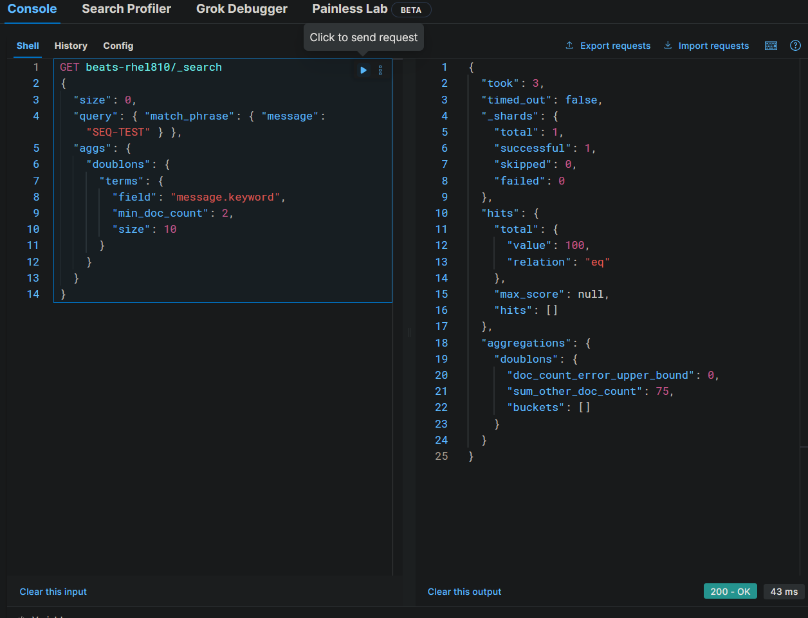
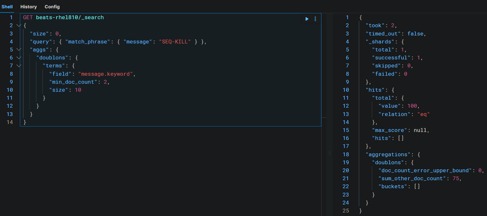
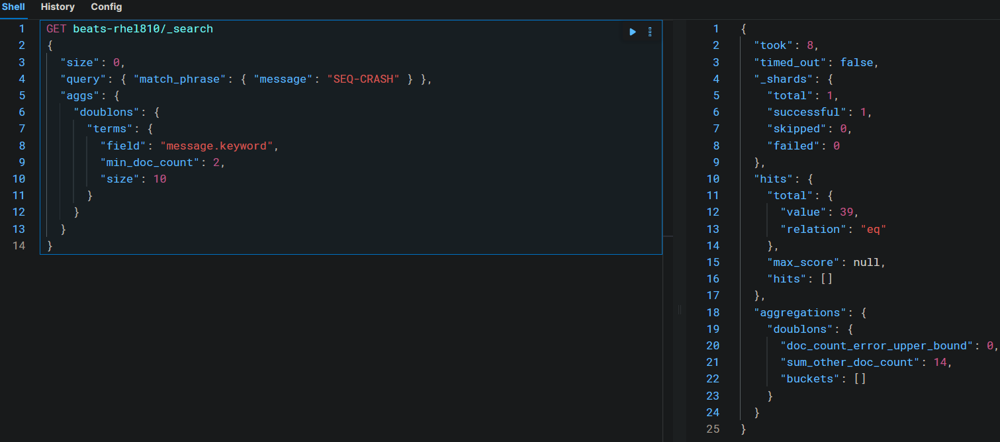
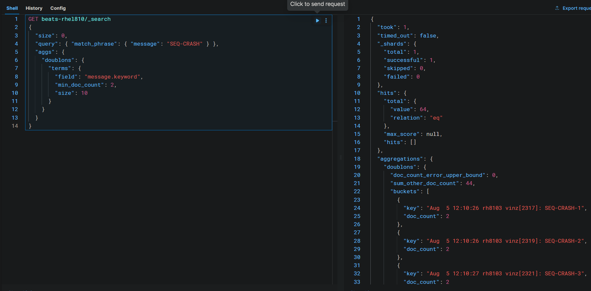

# TP Filebeat/RH8103 → Logstash mTLS : résultat phase 3 (Étape 5 — logrotate)

Complète `tp-filebeat-rh8103-resultat-phase2.md`. Couvre l'Étape 5 du
draft (impact `logrotate` sur `/var/log/messages`) et les deux pièges
ouverts qui l'accompagnaient. L'Étape 6 ("prod ready" : cert expiré,
permissions, retry/backoff) reste à faire.

## Le registre Filebeat, jamais détaillé jusqu'ici (juste comparé au `sincedb`)

Équivalent fonctionnel du `sincedb` de Logstash (note 12), mais avec
un fonctionnement propre, jamais creusé avant ce test.

**Emplacement et contenu.** Par défaut sous `${path.data}/registry`
(`/var/lib/filebeat/registry` dans ce rôle) — un état persisté **par
fichier suivi**, pas juste une position globale : chemin source,
offset de lecture, un **identifiant unique du fichier**, horodatage.
Confirmé par la doc officielle : le nom/chemin seul ne suffit jamais à
identifier un fichier de façon fiable, puisqu'un fichier peut être
renommé ou déplacé (exactement le scénario de `logrotate` testé plus
haut) — d'où le besoin d'un identifiant séparé.

**Deux mécanismes d'identification possibles**, pas un seul :
- **Inode + device** (comportement historique) — fiable tant qu'un
  inode n'est jamais réutilisé par le système pour un autre fichier
  ensuite (cas rare mais documenté comme source réelle de lignes
  sautées)
- **Fingerprint basé sur le contenu** (défaut de l'input `filestream`,
  celui utilisé dans ce rôle — `filebeat_input_type: "filestream"`)
  — pensé précisément pour éviter les doublons liés à la réutilisation
  d'inode, plus robuste que le suivi par inode seul

**Écriture non synchrone par défaut, nuance importante testée
empiriquement.** Le registre est mis à jour fréquemment (à chaque
nouvel event traité, pas sur une période fixe), mais l'option
`registry.flush` vaut `false` par défaut — les écritures passent par
le cache page de l'**OS** (via `write()`), pas immédiatement forcées
sur disque (`fsync`). Point clé, découvert en testant plutôt que
supposé : ce cache est géré par le **noyau**, pas par le process
Filebeat lui-même — la mort du process (`kill -9`) ne l'efface pas,
le noyau continue de le vider vers le disque à son propre rythme,
indépendamment du sort du process qui l'a rempli. Seule une coupure
**du système entier** (crash noyau, coupure électrique) fait
réellement disparaître ce qui n'a pas encore été `fsync`é.

## Résultat final validé

- **Mode de rotation confirmé** : `create` (renommage + nouveau
  fichier), pas `copytruncate` — cohérent avec `/etc/logrotate.conf`
  (aucune surcharge dans `/etc/logrotate.d/syslog`)
- **Transition propre observée** : une ligne test envoyée juste avant
  rotation et une juste après sont toutes les deux arrivées côté
  Kibana, une seule fois chacune, latence normale (~2-8s)
- **Registre Filebeat testé sur 3 essais de redémarrage** (redémarrage
  propre, `kill -9`, coupure brutale de la VM — détail de chacun plus
  bas) : aucune perte ni doublon sur les deux premiers ; sur la
  coupure brutale, 25 doublons — Filebeat a relu le fichier source
  **en entier depuis le début**, signe que sa propre position
  persistée a été perdue par le crash, pas juste un léger
  chevauchement de quelques lignes. Perte supplémentaire identifiée
  en amont, côté rsyslog (contenu du fichier source lui-même
  incomplet après coupure), distincte de ce problème de registre

| Essai | Déclenchement | Perte | Doublon |
|---|---|---|---|
| 1 — Redémarrage propre | `systemctl restart filebeat` | Non (100/100) | Non |
| 2 — Process tué brutalement | `systemctl kill -s SIGKILL filebeat` | Non (100/100) | Non — cache OS intact malgré la mort du process |
| 3 — Coupure brutale de la VM | `echo b > /proc/sysrq-trigger` (sans sync) | Oui, côté rsyslog (voir essai 3) | Oui — 25 lignes rejouées en entier (fichier relu depuis le début) |

Les deux pièges listés comme "ouverts" dans le draft (registre au
redémarrage, double ingestion) sont donc résolus, avec une nuance
importante mise au jour par l'essai 3 : pas de problème sur un
redémarrage applicatif (propre ou brutal), mais une vraie fragilité
sur une coupure système complète.

## Méthode commune aux 3 essais

Script auto-suffisant plutôt qu'une synchro manuelle (tmux, deux
panes) — plus précis, sans risque de décalage humain entre deux
terminaux :
```bash
for i in $(seq "$1" "$2"); do
    logger "SEQ-XXX-$i"
    if [ "$i" -eq "${4:-50}" ]; then
        <déclencheur propre à l'essai>
    fi
    sleep "${3:-0.3}"
done
```
Le déclencheur tourne en arrière-plan (`&` quand pertinent) pour
laisser la boucle `logger` continuer sans bloquer — le scénario
recherché (des lignes qui arrivent **pendant** l'action, pas juste
avant/après) est ainsi garanti au bon `i`, pas approximé par un
timing humain. Vérification par agrégation Elasticsearch, une seule
requête pour perte et doublon à la fois :
```
GET beats-rhel810/_search
{
  "size": 0,
  "query": { "match_phrase": { "message": "SEQ-XXX" } },
  "aggs": {
    "doublons": {
      "terms": { "field": "message.keyword", "min_doc_count": 2, "size": 10 }
    }
  }
}
```

## Essai 1 — Redémarrage propre (`SEQ-TEST-1` à `100`)

`systemctl restart filebeat` déclenché à `i=50`. Résultat :
```json
{
  "hits": { "total": { "value": 100, "relation": "eq" } },
  "aggregations": { "doublons": { "sum_other_doc_count": 75, "buckets": [] } }
}
```
`hits.total.value: 100` — aucune perte. `doublons.buckets: []` —
aucun doublon (`min_doc_count: 2` ne remonte que les valeurs
dupliquées).



## Essai 2 — Process tué brutalement (`SEQ-KILL-1` à `100`)

`systemctl kill -s SIGKILL filebeat` déclenché à `i=50`, service
relancé automatiquement par systemd (`Restart=always`). Même
résultat que l'essai 1 : 100/100, aucun doublon — le cache OS
contenant les dernières écritures du registre survit à la mort du
process, cohérent avec le mécanisme détaillé plus haut.



## Essai 3 — Coupure brutale de la VM (`SEQ-CRASH-1` à `100`)

`echo b > /proc/sysrq-trigger` déclenché à `i=50` — reboot immédiat,
sans `sync`, pour simuler une vraie coupure plutôt qu'un arrêt propre
(`poweroff`/`shutdown` font un `sync` avant de couper, non
représentatifs).

**Juste avant redémarrage de Filebeat** : 39 hits, 0 doublon détecté
à cet instant.



Vérification du contenu réel du disque : seulement **25** lignes
`SEQ-CRASH` physiquement présentes dans `/var/log/messages`
(`grep -c`), alors qu'Elasticsearch en avait déjà **39** au moment du
crash — Elasticsearch en possédait donc **plus** que ce qui restait
sur le disque de RH8103. Cette perte (lignes 26 à 39, disparues du
fichier) s'est jouée **en amont de Filebeat**, chez **rsyslog
lui-même** (écritures de `/var/log/messages` elles aussi non
`fsync`ées au moment de la coupure).

**Après relance de Filebeat** (`Restart=always`, reparti seul) :
total passé de 39 à **64** hits (+25), et les 25 nouveaux documents
sont des doublons **exacts** de `SEQ-CRASH-1` à `-25` (chacun
`doc_count: 2`) — c'est-à-dire **la totalité** des lignes survivantes
sur disque, pas seulement les dernières lignes autour du point
d'arrêt réel.



**Les deux chiffres se recollent exactement** : `39` (déjà envoyées
avant le crash) `+ 25` (rejeu des lignes 1 à 25, encore présentes sur
disque) `= 64`. Les lignes 26 à 39 restent à occurrence unique dans
Elasticsearch — perdues côté rsyslog, donc impossibles à rejouer
puisqu'elles n'existent plus dans le fichier que Filebeat relit.

Coïncidence écartée entre le nombre de doublons (25) et le nombre de
lignes survivantes sur disque (25) : ça révèle que **le registre
Filebeat lui-même a perdu sa position de progression sur ce
fichier**, pas seulement rsyslog son contenu — les écritures du
registre passent par le même cache OS non `fsync`é
(`registry.flush => false`, comme n'importe quelle autre écriture
disque). Au redémarrage, Filebeat n'avait plus aucune trace fiable
d'avoir déjà lu ce fichier, et a relu/renvoyé tout son contenu restant
depuis le début plutôt que de reprendre à la ligne où il s'était
arrêté.

**Conclusion** : le registre Filebeat garantit bien
**"at-least-once"**, jamais "exactly-once" — le scénario le plus
extrême (coupure système) peut faire perdre **sa propre position
persistée**, pas juste provoquer un léger chevauchement de quelques
lignes. Et la vraie fragilité de la chaîne, dans ce test précis,
touche **deux couches distinctes** à la fois (rsyslog et le registre
Filebeat lui-même) — toutes deux victimes du même mécanisme
(écritures non `fsync`ées), pas seulement rsyslog en amont.

## Note annexe : fichier de sauvegarde de rotation absent (résolu, anecdotique)

Premier essai de rotation forcée (`logrotate -f
/etc/logrotate.d/syslog`, sans passer par le point d'entrée global)
ne laissait aucun fichier de sauvegarde daté — expliqué après coup par
`rotateCount is 0` en l'absence du contexte hérité de
`/etc/logrotate.conf`. Sans incidence sur le résultat du TP (le
comportement de Filebeat, lui, est resté cohérent sur tous les
essais) — mentionné pour mémoire, résolu, pas une zone d'ombre
restante.

## Reste à faire (Étape 6)

- Certificat expiré (comportement d'échec documenté, un par host)
- Permissions resserrées sur les clés privées au repos
- Retry/backoff `output.logstash` (distinct de la persisted
  queue/DLQ, Palier 4)
- Cohérence de version Filebeat/Logstash (à décrire, pas un vrai
  risque ici — même version 8.19.x des deux côtés)

## Lien avec les notes existantes

`tp-filebeat-rh8103-resultat-phase1.md`/`-phase2.md` (phases
précédentes), `tp-filebeat-rh8103-draft.md` (Étape 5, design
d'origine), `12-pipelines-config.md` (`sincedb`, comparé au registre
Filebeat — même principe de position persistée validé ici en
pratique).
